<!--
  ════════════════════════════════════════════════════════════════════════════
  ✨  Devang Parekh — GitHub Profile README
  ────────────────────────────────────────────────────────────────────────────
  Renders at: https://github.com/de-waang

  CONFIG NOTES:
  • Stats / streak / trophy / snake widgets pull data from the primary account
    @BravesDevs (46+ repos). To point them at this account instead, replace
    `BravesDevs` with `de-waang` in the widget URLs and workflow options below.
  • The stats / top-langs / pin cards in ./profile/*.svg are generated daily by
    .github/workflows/stats-cards.yml (the public github-readme-stats Vercel
    instance was shut down, so cards are self-generated in-repo via the
    official stats-organization action — they never go offline).
  • The contribution snake is generated by .github/workflows/snake.yml and
    published to the `output` branch of this repo. Both workflows run
    automatically on merge to main, daily, or via manual dispatch.
  ════════════════════════════════════════════════════════════════════════════
-->

<!-- ═══════════ ANIMATED HEADER WAVE ═══════════ -->


<!-- ═══════════ TYPING ANIMATION ═══════════ -->
<p align="center">
  <a href="https://git.io/typing-svg">
    
  </a>
</p>

<!-- ═══════════ PROFILE BADGES ═══════════ -->
<p align="center">
  
  <a href="https://github.com/BravesDevs?tab=followers">
    
  </a>
  <a href="https://github.com/BravesDevs?tab=repositories">
    
  </a>
</p>


<!-- ═══════════ ABOUT ME ═══════════ -->
<h2>  About Me </h2>


```ts
const devang = {
  role: "AI Automation Engineer @ Reklaim",
  location: "Toronto, ON, Canada 🇨🇦",
  focus: ["Agentic AI", "RAG Pipelines", "LLM Workflow Automation"],
  stack: {
    ai: ["Mastra", "RAG", "Pinecone", "Hugging Face", "Prompt Engineering"],
    languages: ["TypeScript", "JavaScript", "Python", "Java", "SQL"],
    backend: ["Node.js", "NestJS", "Next.js", "FastAPI", "Spring Boot"],
    data: ["PostgreSQL", "MongoDB", "MySQL", "Vector DBs"],
    devops: ["AWS", "Docker", "NGINX", "GitHub Actions", "Linux"],
  },
  currentlyBuilding: "Agentable.io — visual AI agent builder",
  funFact: "I teach machines to do the boring parts of my job 🤖",
};
```

<br clear="right"/>

- 🔭 Architecting **end-to-end AI workflows** & automated classification pipelines at **Reklaim**
- 🤖 Building **agentic systems** with Mastra, Vercel AI SDK & multi-provider LLMs (Claude, GPT)
- 🛡️ Engineering **privacy & security controls** for proprietary AI/ML tooling and datasets
- 🌱 Deep-diving into **MCP servers, agent observability & AI security**
- 🎯 Creator of **[Agentable.io](https://github.com/BravesDevs/Agentable.io)** — drag-and-drop AI agent builder
- ⚡ Cut operational manual processing time by **45%** with custom prompt libraries & automation


<!-- ═══════════ EXPERIENCE ═══════════ -->
<h2> 💼 Experience </h2>

<table>
  <tr>
    <td><strong>🏢 Reklaim Inc.</strong> — New York, NY (Remote)</td>
    <td align="right"><strong>Jun 2026 – Present</strong></td>
  </tr>
  <tr>
    <td colspan="2"><strong>AI Automation Engineer</strong></td>
  </tr>
  <tr>
    <td colspan="2">
      • Architected e2e AI workflows, custom prompt libraries & automated classification pipelines — cutting operational manual processing time by <strong>45%</strong><br/>
      • Engineered strict privacy protocols & security controls around proprietary AI/ML tools, algorithms and datasets to prevent unauthorized data exposure<br/>
      • Integrated automated business-intelligence & user-analytics extraction into internal AI pipelines, improving data accuracy and decision-making speed
    </td>
  </tr>
</table>


<!-- ═══════════ TECH STACK ═══════════ -->
<h2> 🛠️ Tech Arsenal </h2>

<h3 align="center">Languages & Frameworks</h3>
<p align="center">
  
</p>

<h3 align="center">Backend & Data</h3>
<p align="center">
  
</p>

<h3 align="center">DevOps & Tooling</h3>
<p align="center">
  
</p>

<h3 align="center">AI / ML</h3>
<p align="center">
  
  
  
  
  
  
  
  
</p>


<!-- ═══════════ FEATURED PROJECTS ═══════════ -->
<h2> 🚀 Featured Projects </h2>

<p align="center">
  <a href="https://github.com/BravesDevs/Agentable.io">
    
  </a>
  <a href="https://github.com/BravesDevs/Gujarati-Accent-Detection">
    
  </a>
</p>

<table align="center">
  <tr>
    <td width="50%" valign="top">
      <h3 align="center">🤖 Agentable.io</h3>
      <p align="center"><em>Visual AI Agent Builder</em></p>
      <ul>
        <li>Drag-and-drop canvas to build, run & deploy AI agents — every flow ships as a <strong>live REST endpoint</strong> in one click</li>
        <li>Multi-provider LLMs (Claude Sonnet/Opus, GPT-4o) streaming token-by-token over SSE with animated edge flow</li>
        <li>Multi-modal inputs — text, files (PDF/CSV/Excel/PPTX), images, JSON, URLs + HTTP tool nodes</li>
        <li><strong>Stack:</strong> Next.js 16 · React Flow · Vercel AI SDK · Mastra · Neon Postgres · Drizzle · MCP · Langfuse</li>
      </ul>
    </td>
    <td width="50%" valign="top">
      <h3 align="center">🗣️ Gujarati Accent Detection</h3>
      <p align="center"><em>ML-powered dialect classifier</em></p>
      <ul>
        <li>Five-way Gujarati regional dialect classification — Ahmedabadi, Charotari, Surati, Mahesani, Kathiyavadi</li>
        <li>Three input paths: typed transcription, browser speech capture (Web Speech API) & audio upload</li>
        <li>Research-grade Keras classifier behind a reproducible Django web interface</li>
        <li><strong>Stack:</strong> Python · Django 5 · Keras · SpeechRecognition · Web Speech API</li>
      </ul>
    </td>
  </tr>
</table>

<p align="center">
  <a href="https://github.com/BravesDevs?tab=repositories">
    
  </a>
</p>


<!-- ═══════════ GITHUB ANALYTICS ═══════════ -->
<h2> 📊 GitHub Analytics </h2>

<p align="center">
  
  
</p>

<p align="center">
  
</p>

<p align="center">
  
</p>

<p align="center">
  
</p>


<!-- ═══════════ LEETCODE ═══════════ -->
<h2> 🧩 LeetCode </h2>

<p align="center">
  <a href="https://leetcode.com/devangmp">
    
  </a>
</p>


<!-- ═══════════ CONTRIBUTION SNAKE ═══════════ -->
<h2> 🐍 Contribution Snake </h2>

<p align="center">
  <picture>
    <source media="(prefers-color-scheme: dark)" srcset="https://raw.githubusercontent.com/de-waang/de-waang/output/github-contribution-grid-snake-dark.svg"/>
    <source media="(prefers-color-scheme: light)" srcset="https://raw.githubusercontent.com/de-waang/de-waang/output/github-contribution-grid-snake.svg"/>
    
  </picture>
</p>


<!-- ═══════════ DEV QUOTE ═══════════ -->
<h2> ✍️ Random Dev Quote </h2>

<p align="center">
  
</p>


<!-- ═══════════ CONNECT ═══════════ -->
<h2> 🤝 Let's Connect </h2>

<p align="center">
  <a href="https://linkedin.com/in/bravesdevs">
    
  </a>
  <a href="https://x.com/BravesDevs">
    
  </a>
  <a href="https://leetcode.com/devangmp">
    
  </a>
  <a href="mailto:devangparekh2014@gmail.com">
    
  </a>
  <a href="https://github.com/BravesDevs">
    
  </a>
</p>

<p align="center">
  <strong>💬 Open to collaborating on agentic AI systems, LLM tooling & open-source — let's build something autonomous.</strong>
</p>

<!-- ═══════════ ANIMATED FOOTER WAVE ═══════════ -->

